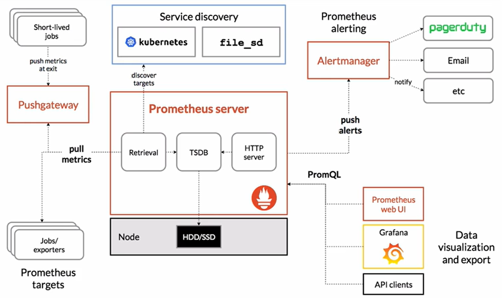

# monitoring_project
## Prometheus uses cases 
- Metric collection
- Alerting
- Visualization 
## Prometheus Architecture

- Prometheus server: collect metrics and make them available
- Exporters: agent that expose data about system/App for collection by the prometheus server 
- Prometheus use a pull model to collect data from exporters(do not push data to the prometheus server ) 